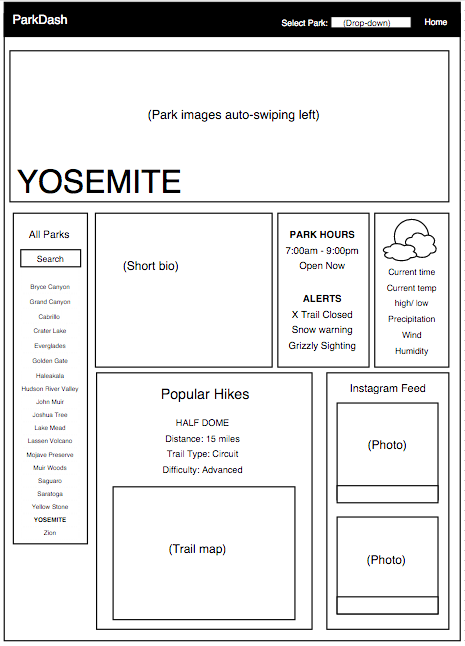

# ParkDash

### Description

Welcome to ParkDash, an interactive dashboard of quick information about the US National Parks. This single-page app makes trip-planning more efficient by providing important info about each park at-a-glance — no searching the NPS websites involved. Enjoy!

### Technologies Used

* MEAN (MongoDB, Express, Angular.js, Node.js)
* Javascript/jQuery
* HTML
* CSS
* Google Maps API
* Wunderground API
* Instagram

### User Stories

A user will be able to:

* Visit a home page with a list of parks to choose from.
* Select a specific park to view a dashboard overview of information.
* Read a bio of the park.
* View a current weather report for the park.
* Visit a link to view 10-day forecast for the park.
* Toggle the weather widget between Farenheight & Celsius.
* View Google maps of the park location in real time.
* View an image of the trail map (click image to zoom).
* View a list of popular hikes ranked from easy, to moderate, to strenuous.
* See a live Instagram feed of photos tagged at the park.

### Goals for Future User Stories

A user will be able to:

* View live alerts of park closures, extreme weather, trail closures, etc.
* Information about wildlife found in the park.
* Sign up for an account to make wish lists of parks to visit.
* Receive texts when live alerts affect parks on their wish list.
* Be able to search for ANY national park/monument.
* View campground information, pet-friendly or not, etc.

### Front-End Wireframes

